# Budgetosaurus Rex Telegram Bot


## 🦖 Overview

Budgetosaurus Rex is a Telegram bot for personal finance management.  
This bot is designed to help you keep track of your finances in a fun and easy way.  

## 💬 Commands and Scenarios

Bot supports the following commands:
- **/start**: Say hello and register yourself.
- **{amount} {description}**: Log a transaction, whether it's money spent or earned.
- **/tips**: Get a random tip to help you manage your money better.
- **/expenses**: See a list of your expenses over a chosen period (Day, Week, Month).
- **/report**: Get a pie chart summary of your expenses and income for a chosen period (Day, Week, Month).

### /start - Register User


### Transaction Tracking


### /expenses - List Expenses

```mermaid
sequenceDiagram
    participant User
    participant Bot

    User->>Bot: /expenses
    Bot-->>User: Choose a range (Day, Week, Month)
    User->>Bot: {range}
    Bot-->>User: Here is the list of your spending for {range}: - {date}: • {expense}
```



### /report - Expense Report


### /tips - Financial Tips


## ▶️ Running it Locally
You need to install the required middleware first:
```shell
python3 -m venv ./pyenv \ 
  && source ./pyenv/bin/activate \
  && pip3 install -r ./python/requirements.txt
```
Make sure you have the postgres instance running on your device, then run the following command:
```shell
export API_TOKEN=<your tg bot api token> \
   && sbt run
```
The easy way is to start all-in-one using [docker-compose](https://docs.docker.com/compose/):
```shell
export API_TOKEN=<your api token>
sbt docker:publishLocal && docker-compose up
```

## 👩‍💼 License
This project is licensed under the [Apache 2.0 License](LICENSE)
