# Budgetosaurus Telegram Bot


## Overview

Budgetosaurus Rex is a Telegram bot for personal finance management.  
This bot is designed to help you keep track of your finances in a fun and easy way.
Built with Scala 3, the Canoe library, and PostgreSQL, Budgetosaurus is here to make managing your money less of a chore and more of a roar!

## What Budgetosaurus Can Do

Bot supports the following inputs:
- **/start**: Say hello and register yourself.
- **{amount} {description}**: Log a transaction, whether it's money spent or earned.
- **/tips**: Get a random tip to help you manage your money better.
- **/expenses**: See a list of your expenses over a chosen period (Day, Week, Month).
- **/report**: Get a pie chart summary of your expenses and income for a chosen period (Day, Week, Month).

## Commands and Scenarios

### /start - Register User


### Transaction Tracking


### /expenses - List Expenses

```mermaid
sequenceDiagram
    participant User
    participant Bot

    User->>Bot: /expenses
    Bot-->>User: Choose a range (Day, Week, Month)
    User->>Bot: {range}
    Bot-->>User: Here is the list of your spending for {range}: - {date}: • {expense}
```



### /report - Expense Report


### /tips - Financial Tips


## Local setup
You need to install the required middleware first:
```shell
python3 -m venv ./pyenv \ 
  && source ./pyenv/bin/activate \
  && pip3 install -r ./python/requirements.txt
```
Make sure you have the postgres instance running on your device.  
To run application locally:
```shell
export API_TOKEN=<your tg bot api token> \
   && sbt run
```
You can also bootstrap application via docker-compose:
```shell
sbt docker:publishLocal && docker-compose up -e API_TOKEN=<your tg bot api token>
```

## License
This project is licensed under the MIT License. See the LICENSE file for details.